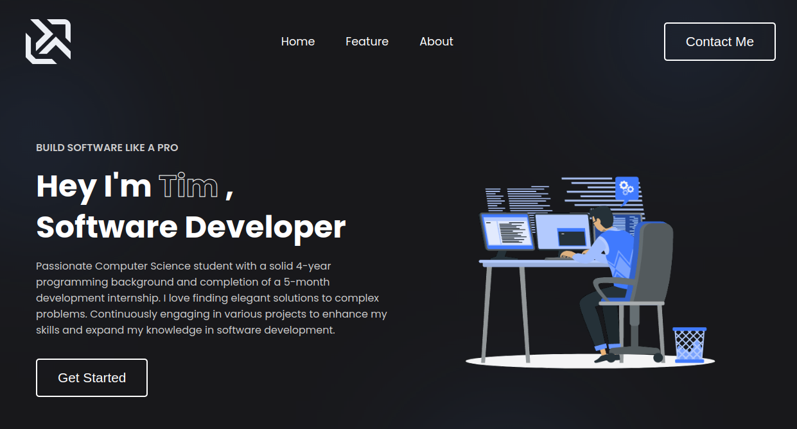
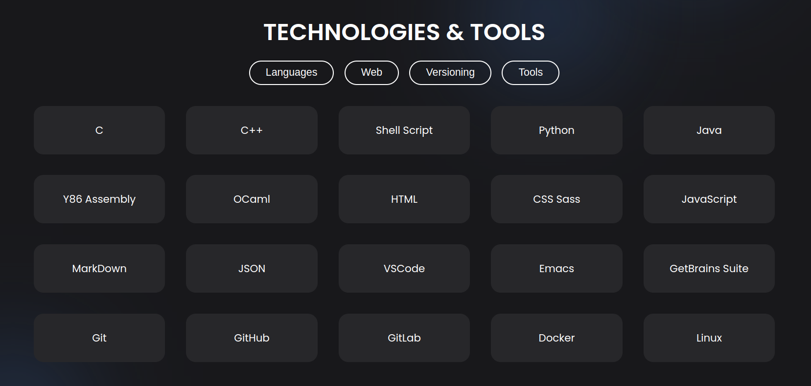

<h3 align="center"> Welcome to my Portfolio 👋🏻<h3>

    
    
    
    

 

## Technologies 🔮

   
<!--  -->

## Under Construction 🚧

This project is being developed and is constantly updated. 
You can check the current version by clicking <strong>[here](https://timlacault.dev).</strong>

## Future Plans 🌌

| Feature | Description | Status |
|:--------|:------------|:------:|
| About Me | Quick presentation of me and my experiences | ✅ |
| Technical Stack | The technologies I use to build my projects | ✅
| Contact Form | Add a contact form | 🚧 |
| Projects Section | Add a section to display my projects | 🚧 |
| Resume Section | Add a section with my resume | ❌ |
| Timeline Section | Add a timeline with my professional history | ❌ |

## Feedback 📢

Any feedback would be appreciated. I you have some, please reach out to me at <strong>[contact@timlacault.dev](mailto:contact@timlacault.dev)</strong>